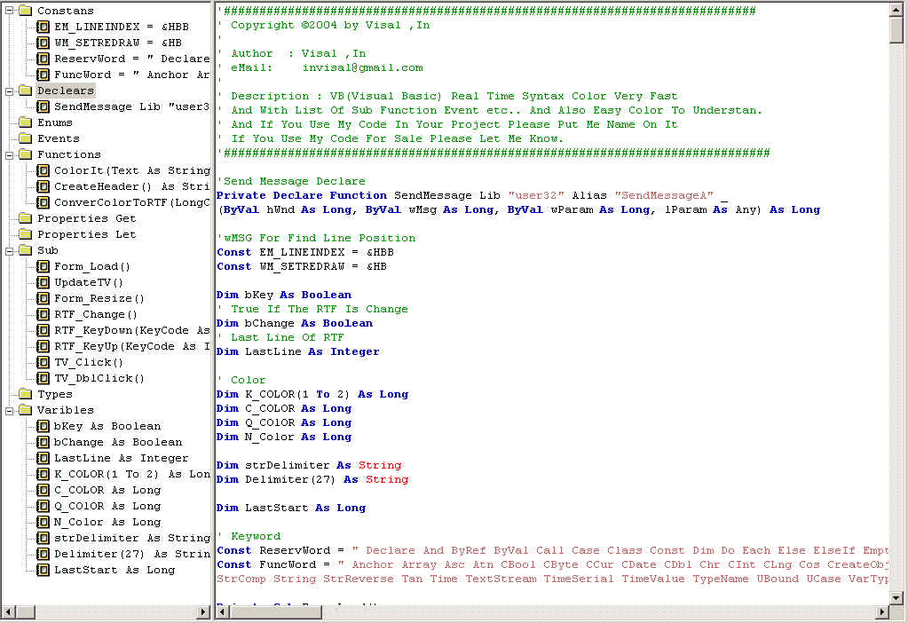



## VB Real Time Syntax Color With Function List

### Description

Super real time color syntax with list of function sub and more also with auto indent you must try it very cool and powerful please vote for me if you like my code thank you.
 
### More Info
 

             |
---                |---
**Submitted On**   |2004-08-01 06:00:22
**By**             |[Visal \.In](https://github.com/Planet-Source-Code/PSCIndex/blob/master/ByAuthor/visal-in.md)
**Level**          |Advanced
**User Rating**    |4.8 (43 globes from 9 users)
**Compatibility**  |VB 6\.0
**Category**       |[String Manipulation](https://github.com/Planet-Source-Code/PSCIndex/blob/master/ByCategory/string-manipulation__1-5.md)
**World**          |[Visual Basic](https://github.com/Planet-Source-Code/PSCIndex/blob/master/ByWorld/visual-basic.md)
**Archive File**   |[VB\_Real\_Ti177644812004\.zip](https://github.com/Planet-Source-Code/visal-in-vb-real-time-syntax-color-with-function-list__1-55285/archive/master.zip)

